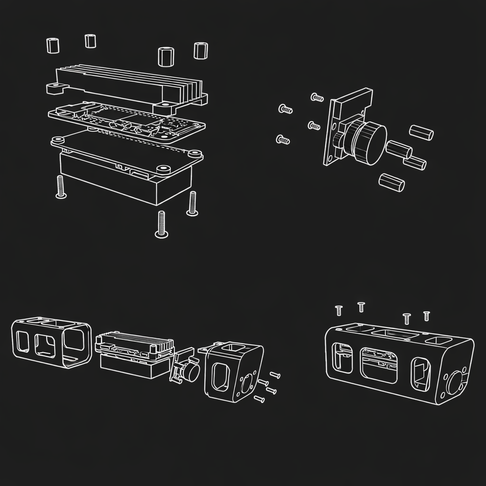

# Pi-Videoreg

[🇬🇧 English](README.md) | 🇷🇺 Русский

[Videoreg.org](https://videoreg.org) — открытый проект по созданию DIY автомобильного видеорегистратора с удалённым доступом.

**Pi-Videoreg** — реализация на базе Raspberry Pi.

## Возможности

- Запись видео (режим видеорегистратора)
- Режим прямой трансляции
- Парковочный режим (периодическая съёмка фото)
- Удаленный доступ через Интернет (WiFi или USB-модем)
- Telegram-бот
- Бот для Вконтакте
- Веб-интерфейс
- WireGuard
- GPS, SMS через USB-модем
- Многопользовательский режим

## Оборудование

- Raspberry Pi Zero 2W
- Поддерживаемая RPi CSI-камера, например OV5647 (см. [подробнее про камеру](#-камера))
- UPS PiSugar 3 (см. [подробнее про питание](#-питание-ups))
- 4G USB-модем, например SIM7600 или A7670 (см. [подробнее про подключение к Интернету](#-подключение-к-интернету))
- Радиатор для RPi (см. [подробнее про температуру](#-температура))

## 3D корпус и сборка

[Скачать модель](https://github.com/videoreg/3d-models/tree/main/pi-videoreg)

[Открыть инструкцию](docs/images/assembly.png)

## Установка

Pi-Videoreg — комплексная система, требующая настройки ОС и собственной сборки [rpicam-apps](https://github.com/videoreg/rpicam-apps). На данный момент единственный поддерживаемый способ установки — использование готового образа `.img` на базе Raspberry Pi OS.

Скачать образ `.img` можно здесь: https://github.com/videoreg/pi-gen.

Запишите образ с помощью официального Raspberry Pi Imager:

1. Выберите "Raspberry Pi Zero 2W" или "No filtering"
2. В нижней части списка выберите установку из локального файла `.img`

## Первый запуск и начальная настройка

По умолчанию устройство создаёт WiFi-сеть (Access Point) с именем `videoreg` и паролем `12345678`.

После подключения откройте в браузере https://10.0.0.1:8443 (браузер может предупредить о недоверенном сертификате — это ожидаемо).

Учётные данные для входа в веб-интерфейс: логин `admin`, пароль `videoreg`.

>[!WARNING]
>Немедленно смените пароль пользователя и пароль WiFi!

### Дата и время

При первом запуске настройте таймзону в Web UI (`Settings → Date & Time`).

Обратите внимание, что плата Raspberry Pi сама по себе не умеет сохранять время между перезагрузками. Есть 2 способа автоматического определения времени после перезагрузки:

1. При [подключении к Интернету](#-подключение-к-интернету) RPi делает запрос к NTP-серверу на каждом старте, откуда получает текущее время.
2. Текущее время сохраняется в RTC в PiSugar 3 (также обновляется после NTP-синхронизации) и при следующем запуске даже без подключения к Интернету время будет актуальным.

### Telegram Bot

1. В веб-интерфейсе в Настройках `Telegram Bot` задайте токен вашего бота.
2. Во вкладке `Users` укажите id вашего пользователя в телеграме от имени которого вы будете общаться с ботом.
3. В чате с ботом выполните команду `/start` — она проинициализирует меню бота.

### WireGuard

Если вы планируете сохранять доступ к Web UI через USB-модем или не из "домашней WiFi сети", то настройте WireGuard.

### Интервал пробуждения

При использовании PiSugar 3 UPS вы можете задать интервал пробуждения в режиме парковки в настройках питания: `Settings → Power`.

### SMS

Если вы используете USB-модем, то вы можете настроить выполнение команд и переадресацию SMS на ваш мобильный телефон. Для этого укажите свой номер телефона в Настройках `SMS`.

### SSH

Для доступа по SSH используйте пользователя `vrg` с паролем `videoreg123`.

## Запуск через Docker

Для знакомства с системой или локальной разработки выполните `docker compose up --build` (в дальнейшем достаточно `docker compose up`).

## Соображения

### 🤔 Raspberry Pi, Linux и Python в видеорегистраторе?

- RPi + Linux + Python — самый быстрый способ собрать прототип и ответить себе на вопрос "это вообще возможно?"
- Низкий порог вхождения.
- Оптимальная производительность: у нас получилось реализовать все необходимые фичи (запись видео 1080p30, прямую трансляцию, HTTP) и вписаться в адекватные рамки по запасу CPU, температуре и потреблению энергии.

Но в целом, перевод текущей реализации на компилируемый язык выглядит вполне разумным развитием проекта. Языки `C/C++` видятся наиболее перспективными из-за возможности переиспользования логики в реализации под ESP32.

> [!TIP]
> Важно подчеркнуть, что основная задача, запись видео, по-умолчанию реализована на C++ и использует hardware-кодеки. А именно, запись видео и фото происходят через доработанную версию [rpicam-apps](https://github.com/videoreg/rpicam-apps).

### 📷 Камера

Основные требования к камере:

- Необходима камера с подключением по CSI MIPI. USB-камеры в рамках Raspberry Pi Zero 2W не могут обеспечить нужную производительность.
- Широкий угол обзора. Идеальный вариант `160°`. Учитывайте, что запись видео обычно происходит не с полной матрицы, а с кропом. Это значит, что фактический угол обзора на видео будет `~120°` вместо `160°`.

Протестированные модели:

- [Waveshare RPi Camera (G)](https://www.waveshare.com/rpi-camera-g.htm)
- [Pi Camera Module 3](https://www.raspberrypi.com/products/camera-module-3/)

### 🔋 Питание, UPS

Самое главное, зачем нужен UPS, — чтобы корректно завершить работу RPi после отключения от внешнего источника питания. Также, аккумулятор нужен для реализации сценария периодической съемки на парковке.

#### Вариант: постоянное питание от аккумулятора автомобиля без UPS

В этом случае нам необходимо решить проблему выключения RPi при выключении зажигания. По-умолчанию, это будет моментальное обесточивание платы — лучше даже не экспериментировать. Одно из направлений, в котором можно поэкспериментировать: использовать устройства для видеорегистраторов, которые подключаются в разъем предохранителей и сохраняют напряжение 5V от аккумулятора при отключении зажигания, а также имеют провод-индикатор - двигатель запущен или нет.

#### Вариант: UPS на Литий-ионных или литий-полимерных аккумуляторах

Как уже было упомянуто, [PiSugar 3](https://www.pisugar.com/products/pisugar-3-raspberry-pi-zero-battery) — это самый подходящий и функциональный UPS, реализующий всё что необходимо:

- обесточивание RPi (по-умолчанию `shutdown` не обесточивает RPi);
- RTC (эмуляция);
- RTC Alarm (включение RPi в заданное время по будильнику);
- I2C: управление и получение информации о состоянии UPS.

**Другие UPS без возможности программного обесточивания RPi:**

- [Waveshare UPS HAT (C)](https://www.waveshare.com/ups-hat-c.htm): поддержка I2C, Pogo pins.
- [Geekworm X306 UPS Shield](https://geekworm.com/products/x306): без I2C, Pogo pins, аккумулятор 18650.
- [DFRobot UPS HAT](https://www.dfrobot.com/product-1932.html): поддержка I2C, необходимо распаять 40-pin коннектор на RPi.

**Очевидные недостатки UPS с аккумулятором:**

- опасность связанная с нестабильностью литиевых аккумуляторов;
- деградация аккумулятора из-за повышенных температур.

#### Вариант: UPS на суперконденсаторах

Такое решение позволяет корректно завершить работу RPi при отключении внешнего питания (остановке двигателя автомобиля). Но в то же время, невозможно реализовать логику парковочного режима (пробуждения по таймеру).

В целом, это пожалуй один из самых приоритетных вариантов UPS, но предложение на рынке очень ограничено.

### 📡 Подключение к Интернету

#### Вариант 1: без подключения к Интернету

Вы можете использовать основные функции видеорегистратора: запись видео и парковочный режим (только вместе с PiSugar 3). Доступ к Web UI вы можете получать через точку доступа WiFi (Access Point), которую создаёт устройство.

#### Вариант 2: подключение к WiFi роутеру

Вы можете подключить устройство к любой WiFi сети с выходом в Интернет (телефон, автомобиль, домашний или переносной роутер). В этом случае вам будет доступно взаимодействие через Telegram Bot.

Подключение к WiFi роутеру открывает следующие возможности:

- Интеграция в локальную сеть с помощью WireGuard: вы можете открывать Web UI удалённо, а видеорегистратор получает возможность взаимодействия с устройствами в этой сети, например загрузку контента на домашний NAS (функция не реализована).
- Прямая трансляция видео.

#### Вариант 2: подключение через USB-модем

> [!CAUTION]
> Обязательно оставьте включенным WiFi Access Point, если не уверены, что вы сможете попасть в Web UI через подключенный USB-модем. Только после успешной настройки WireGuard можно отключить WiFi модуль

Протестирована работа устройства с модемами SIM7600 и A7670.

Подключение модема открывает следующие возможности (в дополнение к предыдущим):

- Удалённый доступ к устройству в любом месте, где есть мобильная сеть.
- GPS трекинг: автоматически будет вестись запись трека каждой поездки.
- SMS: управление устройством через команды по СМС, а также переадресация входящих СМС в Telegram Bot.

### 📅 RTC: дата и время

Необходимость сохранять дату и время между перезапусками — основополагающее требование для корректной работы системы. Как было упомянуто [выше](#дата-и-время), есть 2 способа сохранить дату и время при перезагрузке: NTP-синхронизация через Интернет и RTC в PiSugar 3 UPS. Поэтому запуск системы без подключения к Интернету или RTC, в настоящее время, не рассматривается.

Особенности программной эмуляции RTC на основе PiSugar 3 были учтены в systemd-сервисах `vrg-hwclock-load.service` & `vrg-hwclock-save.service`.

### 🌡️ Температура

Необходимое требование к сборке:

- Наличие радиатора для Raspberry Pi. Например [Geekworm C296](https://geekworm.com/products/c296) 10mm Aluminum Alloy Heatsink.
- Корпус с большим количеством отверстий.

**Фактор 1:** повышенная температура RPi в процессе записи видео.

Реализована логика деградации качества видео при нагреве CPU:

- `> 60°C`: качество видео принудительно уменьшается до `720p 15 fps`.
- `> 65°C`: запись видео останавливается и включается режим периодической съемки фото (раз в 10 сек.).
- Если был включен режим деградации, то при опускании температуры до `55°C` настройки записи видео возвращаются к заданным пользователем.

**Фактор 2:** нагрев от UPS PiSugar в процессе зарядки аккумулятора.

Наблюдение: при отключении порога зарядки в 80% (отключении режима сбережения аккумулятора в настройках) UPS нагревается заметно меньше.

**Фактор 3:** высокая температура окружающей среды.

Пожалуйста, не используйте устройство при температуре окружающей среды выше `35°C`.

### 🏛️ Архитектура

Основные компоненты: `systemd-сервисы` и `плагины`.

**Systemd-сервисы** с префиксом `vrg-*` — основные процессы, в рамках которых выполняются один или несколько плагинов.

**Плагины** реализуют конкретную логику: взаимодействие с камерой, сетью, питанием и т.д.

Компоненты общаются между собой через Unix socket (event bus) реализованный в плагине `org_vrg_bus`.

Соответствие сервисов и плагинов определяется в `videoreg.manifest.yaml`. Текущая конфигурация:

| systemd-сервис | плагины |
|---|---|
| **vrg-core** | **core** — общая логика **bus** — шина событий (Unix socket) **net** — сеть: WiFi, WireGuard, модем **power** — питание, батарея, PiSugar **stat** — статистика: CPU, диск, трафик |
| **vrg-camera** | **camera** — видео, фото, live-стрим |
| **vrg-modem** | **modem** — доступ к модему по AT: GPS-трекинг, SMS, информация о модеме |
| **vrg-http** | **http** — HTTPS-сервер |
| **vrg-bot** | **bot** — Telegram-бот |
| **vrg-pisugar-watchdog** | Watchdog (без плагинов) |
| **vrg-mediamtx** | MediaMTX для live-стрима (без плагинов) |

> [!TIP]
> Systemd-сервисы зависят от `vrg-boot.target`, поэтому для перезапуска можно использовать команду `systemctl restart vrg-boot.target`.

> [!NOTE]
> Запуск системы с флагом `--env dev` (например при вызове `docker compose up`) использует `videoreg.manifest.dev.yaml`, где все плагины запускаются в рамках одного (псевдо-) сервиса.

#### Порядок запуска

`vrg-core` запускается первым как сервис `Type=notify`: он поднимает шину событий (`org_vrg_bus`) раньше остальных своих плагинов и посылает systemd сигнал `READY=1` только после старта всех плагинов. Остальные сервисы объявляют `After=vrg-core.service` + `Requires=vrg-core.service`, поэтому запускаются (параллельно друг с другом) только когда шина уже готова. Это устраняет прежнюю гонку старта, когда клиентам шины приходилось повторять попытки подключения к ещё не слушающему сокету.

#### Мотивация разделения функций по разным systemd-сервисам

- Более устойчивая система. Например, проблемы в Telegram Bot не влияют на базовую функцию записи видео.
- Возможность создавать сервисы реализованные на разных технологиях. Например, можно реализовать сервис на `C/C++` который будет взаимодействовать с другими сервисами на `Python` через event bus.
- Возможность выделять части системы, которые запускаются по условию («target» в терминах `systemd`). Например, можно запускать сервис только при подключенном внешнем источнике питания `vrg-charging.target`.
- В будущем: выполнение сервисов от имени разных linux-пользователей для более гибкого разграничения прав доступа к разным частям системы и повышения приватности/безопасности.

## Планы на развитие, нерешенные проблемы

### Направление: hardware

**Проблема отключения модема в парковочном режиме**: при использовании PiSugar UPS, USB-модем теряет питание вместе с RPi. Включается он так же безусловно вместе с RPi. И если мы говорим о режиме периодического мониторинга на парковке, то у такого поведения есть следующие недостатки:

- Необходимость переподключения к мобильной сети на каждом старте. RPi вынуждена быть дольше включенной, чтобы дождаться подключения к Интернету (есть ограничение в 20 сек.) — это приводит к повышенному расходу заряда аккумулятора.
- В режиме подключения к сети модем потребляет кратно больший ток, чем в обычном режиме. И такие периодические «просыпания» заметно расходуют заряд аккумулятора.
- GPS-приемник стартует «на холодную» и не успевает получить координаты за короткое время.
- Логика периодического мониторинга допускает то что ответ на команды пользователя будет иметь очень большую задержку. И в целом, с целью экономии заряда аккумулятора, можно было бы включать USB-модем не на каждый запуск RPi.

Варианты решения:

1. Подключение модема к RPi через управляемый (по GPIO) USB выключатель. Это позволило бы программно реализовать логику включения модема на стороне RPi.
2. Не отключать питание у USB-модема, а переводить его в спящий режим. При использовании PiSugar 3 это невозможно. Других готовых решений не было найдено. Поэтому здесь, видимо, требуется разработка кастомной печатной платы с управлением питанием.

### Направление: разработка

**Повысить безопасность связанную с начальным запуском:** при первом запуске устройства автоматически создается пользователь `admin` с преднастроенным паролем, а также WiFi Access Point `videoreg`.

При первой авторизации в Web UI пользователя обязывают указать **свой** новый пароль, но смена пароля от WiFi сети — это всё еще рекомендация, и это проблема. Необходимо найти решение.

**Покрыть код тестами:** в целях повышения стабильности необходимо покрыть код как юнит-тестами, так и сделать решение для интеграционных тестов.

**Создать плагин выгрузки контента в удаленное сетевое хранилище:** выгружать фото и видео, условно, на домашний NAS.

**Добавить возможность установки сторонних плагинов:** архитектура на основе плагинов уже предполагает, что их набор может быть произвольным. Необходимо сделать решение для установки дополнительных сторонних плагинов. В рамках этой же задачи нужно сделать, чтобы каждый плагин запускался от имени своего пользователя.

**Создать движок уведомлений пользователя:** рассмотрим проблему на примере переадресации входящих СМС в Telegram. Если по каким-то причинам отправка сообщения в Telegram не была выполнена (например, были проблемы с сетью), то отправка не повторится. Похожее поведение сейчас будет во всех случаях.

## Лицензия

Этот проект распространяется под лицензией [GNU Affero General Public License v3.0](LICENSE).
